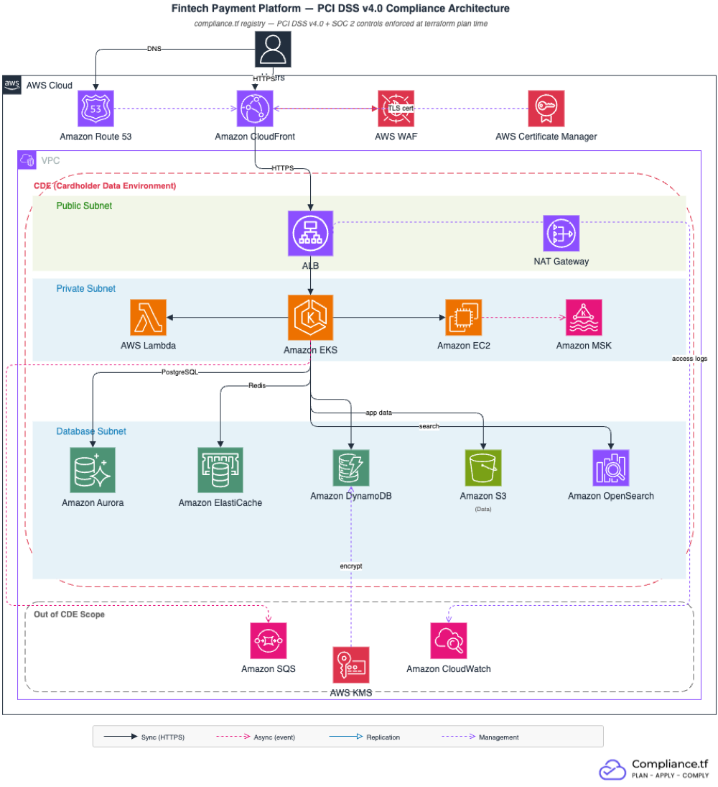

# Fintech Starter Kit - PCI DSS v4.0

Terraform configuration that deploys PCI DSS v4.0-compliant AWS infrastructure for fintech companies. Modules are sourced from the [compliance.tf registry](https://pcidss.compliance.tf), which validates PCI DSS controls at `terraform plan` time — non-compliant configurations fail before they can be applied.

## Architecture



## Prerequisites

- Terraform >= 1.3
- AWS credentials configured (`aws configure` or environment variables)
- A compliance.tf access token ([sign up](https://compliance.tf) or [start a free trial](https://compliance.tf/free-trial/))
- A Route 53 hosted zone for your domain (used for ACM DNS validation)
- **S3 cross-region replication resources** (a kit prerequisite supporting audit-log durability; PCI DSS Req. 10.5.1 itself mandates 12 months of audit-log retention with the most recent 3 months immediately available):
  - An IAM role ARN authorized for S3 replication (`s3_replication_role_arn`)
  - A destination S3 bucket in your DR region (`s3_replication_destination_bucket_arn`)

> **CloudFront + ACM:** CloudFront only accepts certificates from `us-east-1`, regardless of where your other resources are. This kit handles that with a provider alias — two ACM certificates get provisioned, one regional and one global. Both use the same Route 53 zone for DNS validation.

## Quick Start

```bash
# 1. Clone the repo
git clone https://github.com/compliancetf/starter-kit-fintech-pcidss.git
cd starter-kit-fintech-pcidss

# 2. Copy the example tfvars and fill in your values
cp terraform.tfvars.example terraform.tfvars
# Edit terraform.tfvars - set at minimum:
#   project_name, domain_name, route53_zone_id,
#   availability_zones (must match aws_region),
#   s3_replication_role_arn, s3_replication_destination_bucket_arn

# 3. Authenticate with the compliance.tf registry
terraform login pcidss.compliance.tf

# 4. Initialize, plan, and apply
terraform init
terraform plan
terraform apply
```

`terraform plan` fails if any required PCI DSS controls are not satisfied — the error names the specific control and the module that triggered it. Fix the issue and re-run. A clean plan with the default configuration produces about 130 resources.

## Module Inventory

Every source below is a browsable page on the registry, with versions, inputs, and outputs - browse all modules at [pcidss.compliance.tf](https://pcidss.compliance.tf).

| Module | Source | Version | Purpose | Key PCI DSS Requirements |
|--------|--------|---------|---------|--------------------------|
| `vpc` | `pcidss.compliance.tf/terraform-aws-modules/vpc/aws` | `~> 6.0` | CDE network isolation, flow logs | 1.3 (restrict CDE network access), 10.2 (flow logs) |
| `alb` | `pcidss.compliance.tf/terraform-aws-modules/alb/aws` | `~> 10.0` | HTTPS load balancing, access logs | 4.2.1 (TLS 1.2+), 6.4.1 (WAF association) |
| `cloudfront` | `pcidss.compliance.tf/terraform-aws-modules/cloudfront/aws` | `~> 6.0` | CDN edge with TLS enforcement and WAF | 4.2.1 (TLS at edge), 6.4.1 (WAF) |
| `waf` | `pcidss.compliance.tf/terraform-aws-modules/wafv2/aws` | `~> 1.0` | Regional WAF (ALB) - OWASP Top 10, IP reputation | 6.4.1 (web application protection) |
| `waf_global` | `pcidss.compliance.tf/terraform-aws-modules/wafv2/aws` | `~> 1.0` | Global WAF (CloudFront, us-east-1) | 6.4.1 (web application protection at edge) |
| `acm` | `pcidss.compliance.tf/terraform-aws-modules/acm/aws` | `~> 6.0` | Regional TLS certificate | 4.2.1 (strong cryptography in transit) |
| `acm_us_east_1` | `pcidss.compliance.tf/terraform-aws-modules/acm/aws` | `~> 6.0` | Global TLS certificate (CloudFront) | 4.2.1 (strong cryptography in transit) |
| `kms` | `pcidss.compliance.tf/terraform-aws-modules/kms/aws` | `~> 4.0` | Customer-managed key wired to EKS, Lambda, and OpenSearch | 3.5.1 (PAN rendered unreadable wherever stored) |
| `eks` | `pcidss.compliance.tf/terraform-aws-modules/eks/aws` | `~> 21.0` | Kubernetes cluster (private endpoint, secrets encrypted) | 2.2 (configured and managed securely), 10.2 (audit logs) |
| `lambda` | `pcidss.compliance.tf/terraform-aws-modules/lambda/aws` | `~> 8.0` | VPC-attached functions with KMS environment encryption | 1.3 (restrict CDE network access), 3.5.1 (encryption) |
| `ec2_instance` | `pcidss.compliance.tf/terraform-aws-modules/ec2-instance/aws` | `~> 6.0` | Private worker nodes (IMDSv2, IAM instance profile) | 2.2 (no public IP, IMDSv2 enforced) |
| `rds_aurora` | `pcidss.compliance.tf/terraform-aws-modules/rds-aurora/aws` | `~> 10.0` | Aurora PostgreSQL (encrypted, IAM auth, Multi-AZ) | 3.5.1 (encryption at rest), 10.2 (audit logs) |
| `dynamodb` | `pcidss.compliance.tf/terraform-aws-modules/dynamodb-table/aws` | `~> 5.0` | Key-value store (KMS encryption, point-in-time recovery) | 3.5.1 (encryption at rest) |
| `elasticache` | `pcidss.compliance.tf/terraform-aws-modules/elasticache/aws` | `~> 1.0` | Redis (encrypted at rest and in transit) | 4.2.1 (TLS in transit) |
| `s3_bucket_data` | `pcidss.compliance.tf/terraform-aws-modules/s3-bucket/aws` | `~> 5.0` | CDE data storage (KMS, versioning, replication) | 3.5.1 (encryption at rest), 3.5 (no public access) |
| `s3_bucket_logs` | `pcidss.compliance.tf/terraform-aws-modules/s3-bucket/aws` | `~> 5.0` | Audit log storage (versioning, cross-region replication, 365-day lifecycle) | 10.3 (log protection), 10.5.1 (log retention) |
| `sqs` | `pcidss.compliance.tf/terraform-aws-modules/sqs/aws` | `~> 5.0` | Message queue with dead-letter queue | 3.5.1 (SSE encryption) |
| `opensearch` | `pcidss.compliance.tf/terraform-aws-modules/opensearch/aws` | `~> 2.0` | VPC-only search (KMS, HTTPS, fine-grained access, audit logs) | 10.2 (audit logs), 10.3 (log protection) |
| `cloudwatch` | `pcidss.compliance.tf/terraform-aws-modules/cloudwatch/aws//modules/log-group` | `~> 5.0` | Application log group (365-day retention) | 10.2 (audit logs), 10.5.1 (log retention) |

> **MFA Delete needs a manual root step:** This kit does not enable S3 MFA Delete by default, and disables the `s3_bucket_mfa_delete_enabled` control on the two buckets. Two AWS constraints force this: MFA Delete can only be enabled with root-account credentials and an MFA code (a standard `terraform apply` cannot do it), and AWS does not support S3 Lifecycle configurations on MFA-Delete-enabled buckets (see the [AWS docs](https://docs.aws.amazon.com/AmazonS3/latest/userguide/MFADelete.html)), while the logs bucket ships a 365-day lifecycle. MFA Delete adds tamper-resistance for versioned objects; if your assessor requires it, enable it manually as root on a bucket without lifecycle rules - root should perform only that single operation.

## PCI DSS v4.0 Control Coverage

| PCI DSS 4.0 Requirement | Description | Module(s) | What's Enforced |
|--------------------------|-------------|-----------|-----------------|
| 2.2 | System components are configured and managed securely | EC2, EKS | IMDSv2 required, no public IPs, IAM instance profiles, private cluster endpoint |
| 3.5.1 | PAN is rendered unreadable anywhere it is stored | S3, RDS Aurora, DynamoDB, Lambda, KMS | KMS encryption at rest for CDE data stores |
| 3.5 | Primary account number (PAN) is secured wherever it is stored | S3, RDS Aurora | Public access blocked, encryption enforced |
| 4.2.1 | Strong cryptography and security protocols safeguard PAN during transmission | ALB, CloudFront, ElastiCache | TLS 1.2+ enforced on all connections |
| 6.4.1 | Public-facing web applications are protected against known attacks on an ongoing basis | ALB, CloudFront | WAF with AWS managed rules (OWASP Top 10, known bad inputs, IP reputation) |
| 10.2 | Audit logs are implemented to support detection and forensic analysis | All modules | VPC flow logs, ALB access logs, EKS audit logs, CloudWatch log groups |
| 10.3 | Audit logs are protected from destruction and unauthorized modifications | S3 (logs), OpenSearch | S3 versioning with replication, OpenSearch index retention |

## CDE Scoping

The Cardholder Data Environment (CDE) is the set of system components that store, process, or transmit cardholder data. In this kit:

**In CDE scope:** VPC private subnets, EKS, Lambda, EC2, RDS Aurora, DynamoDB, ElastiCache, S3 (data bucket), OpenSearch

**Out of CDE scope:** CloudFront edge nodes (AWS-managed infrastructure), SQS (application queuing for non-PAN data), CloudWatch log group (aggregated logs only)

Reducing CDE scope reduces QSA audit hours. See the [PCI DSS scoping guidance](https://compliance.tf/docs/frameworks/pcidssv40/scoping/) for details.

## What compliance.tf Covers vs. What You Own

### compliance.tf handles (infrastructure controls)

- KMS encryption at rest for CDE data stores
- TLS 1.2+ on all connections, enforced at both ALB and CloudFront
- WAF with AWS managed rules: OWASP Top 10, known bad inputs, IP reputation
- Network isolation — databases and caches have no public routes
- IMDSv2 on all EC2 instances (IMDSv1 disabled)
- IAM authentication required for RDS, DynamoDB, and OpenSearch
- VPC flow logs, ALB access logs, and CloudWatch audit trail
- Deletion protection on RDS and ALB in `environment = "prod"`

### You own (application and organizational controls)

- Tokenization and PAN handling in application code — compliance.tf does not tokenize
- Key rotation procedures and key administrator access policies
- User access reviews and role assignments
- Change management approvals and evidence collection
- Annual penetration testing (PCI DSS 11.4.3 requires external testing at least once every 12 months)
- QSA engagement and Report on Compliance (ROC) preparation
- Cardholder data discovery and formal CDE scope documentation

## Cost Estimate

Approximate monthly cost for the default configuration. Actual costs depend on usage, data transfer, and region.

| Component | Dev | Prod | Notes |
|-----------|-----|------|-------|
| VPC + NAT Gateway | ~$35 | ~$100 | Single NAT (dev) vs. per-AZ (prod) |
| ALB | ~$25 | ~$25+ | Plus LCU charges based on traffic |
| CloudFront | ~$1 | ~$5+ | Per-request charges, PriceClass_100 |
| EKS | ~$75 | ~$75 | Control plane; node costs below |
| EKS Nodes (t3.medium) | ~$60 | ~$120+ | 2 nodes (dev) vs. 2-6 nodes (prod) |
| Aurora PostgreSQL (db.r6g.large) | ~$200 | ~$400 | 1 instance (dev) vs. writer + reader (prod) |
| ElastiCache (cache.t4g.micro) | ~$10 | ~$20 | 1 node (dev) vs. 2 nodes with failover (prod) |
| OpenSearch (t3.small.search) | ~$20 | ~$60 | 1 node (dev) vs. 3 nodes (prod) |
| S3 + Lambda + SQS + EC2 | ~$30 | ~$60+ | Scales with usage |
| **Total (order of magnitude)** | **~$500-700** | **~$1,500-2,500** | |

## Other Starter Kits

| Kit | Frameworks | Use Case |
|-----|-----------|---------|
| [B2B SaaS - SOC 2](https://github.com/compliancetf/starter-kit-saas-soc2) | SOC 2 | SaaS companies selling to enterprise customers |
| [HealthTech - HIPAA](https://github.com/compliancetf/starter-kit-healthtech-hipaa) | HIPAA | Telehealth, EHR, health data platforms |

## Links

- [compliance.tf docs](https://compliance.tf/docs/)
- [PCI DSS v4.0 framework guide](https://compliance.tf/docs/frameworks/pcidssv40/)
- [Migration guide](https://compliance.tf/docs/guides/migration/)
- [Controls reference](https://compliance.tf/docs/controls/)

## License

Apache 2.0. See [LICENSE](LICENSE).
